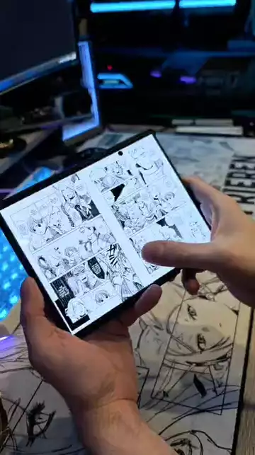
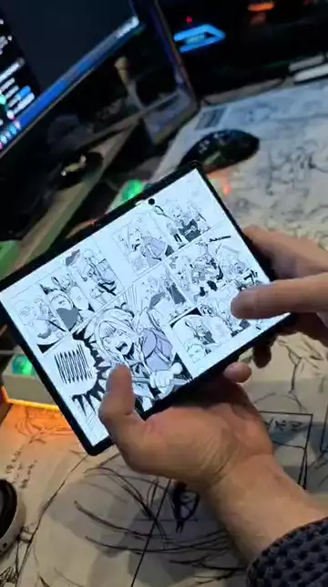

<div align="center">


# Foldchiyomi

### Mihon, made for foldables — with a page turn that feels like paper

[](https://github.com/GarrettKK/Foldchiyomi/releases/latest)
[](/LICENSE)

*Requires Android 8.0 or higher.*

</div>

<p align="center">
  
</p>

Foldchiyomi is an unofficial fork of [Mihon](https://github.com/mihonapp/mihon), the manga reader, tuned for foldable phones and tablets. Unfold your phone and you get a two-page spread; fold it and the cover screen goes back to one page. Turn a page and it curls like a real one.

Nothing else like it exists right now: page curls in other readers are canned animations, and none of them turn a two-page spread like a book. Here the page follows your finger.

## The page curl

- **Grab the edge or a corner.** The page rolls over under your finger. Pull from a corner and it folds diagonally; pull from the middle of the edge and it folds straight.
- **You see the back of the sheet.** In a two-page spread, the back of the leaf is the next spread's page landing into place, like a real book. On a single page, the print shows faintly through the paper.
- **Real shadows.** The rolled paper casts a shadow on the page it uncovers, and the folded flap casts one on the page beneath it.
- **Every direction.** Going back plays the same curl in reverse, right-to-left manga is mirrored, and taps or volume keys curl the page from the bottom corner.
- **Native and fast.** It runs entirely on the GPU (WebGPU via Dawn) inside the reader's own renderer, not as a video overlay or a screenshot trick. That keeps it smooth at your screen's full refresh rate.

It is the default page transition. You can pick another one, or turn animations off, in the reader settings.

## Bubble zoom

<p align="center">
  
</p>

Double-tap a speech bubble and it lifts off the page, enlarged, the way Google Play Books does it. The rest of the page stays where it is, and a tap anywhere puts the bubble back.

The enlarged bubble is upscaled by ArtCNN, a small neural network for line art that runs on the phone's GPU, and cleaned up: paper to white, ink to black. Lettering stays crisp even on low-quality scans.

It finds the bubble right on your phone, from the page itself: the light paper inside a dark outline, with lettering in it. That covers most manga, and Western comics' speech bubbles and narration boxes too. Text without a bubble and bubbles with no outline aren't picked up, and there double-tap zooms in as usual.

While a bubble is open, tap the next one and it opens in its place. Prefer a long press to a double tap? Pick it under **Bubble zoom gesture**. And with **Zoom to panel** on, the same gesture on artwork zooms the page to the panel under it.

Don't want it? Turn it off in **Settings → Reader → Paged → Bubble zoom**, or from the reader's settings sheet.

## Made for a mixed library

Open a series for the first time and the reader asks how it reads, right to left for manga or left to right for comics, and remembers it for that series.

## The icon

An open book of panels, and a speech bubble saying 折 (*ori*), "to fold": the fold of the phone, and the fold of the page. The icon was designed by a reader from the community, who offered it after trying the app.

## Everything else is Mihon

Your library, extensions and extension repositories, trackers, backups, categories and downloads all work exactly as they do in Mihon. You can restore a Mihon backup into Foldchiyomi. It installs next to Mihon rather than replacing it.

To add an extension repository, open **Settings → Browse → Extension repos** and paste the repository's index URL.

## Download

Get the APK from [Releases](https://github.com/GarrettKK/Foldchiyomi/releases/latest):

- `Foldchiyomi-<version>-arm64-v8a.apk` is for almost every modern phone.
- `Foldchiyomi-<version>-universal.apk` works on any device if you're not sure.

Updates are published there too, and the app tells you when a new one is out (**More → About → Check for updates**). Every release is signed with the same key, so updates install over the previous version.

## Privacy

- **No analytics and no crash reporting.** Mihon's optional Firebase telemetry is not included in any Foldchiyomi build: the telemetry module compiles to a no-op.
- **No accounts or servers of our own.** Foldchiyomi doesn't phone home.
- **Network traffic is only what you ask for.** That means the sources and extension repositories you add, the trackers you log into, and the update check, which asks GitHub for this repository's latest release.
- **Builds are public.** Releases are built by GitHub Actions from this repository's source, and you can read each build's workflow and logs.

## Honest disclaimer

This fork was vibe-coded: the page curl and the packaging were written together with an AI coding assistant (Claude), then tested by hand on real devices. It works well for me, but it hasn't been through the kind of review Mihon's own code gets. Please report bugs in [Issues](https://github.com/GarrettKK/Foldchiyomi/issues), not to the Mihon team: they don't support forks.

## Found a bug?

Open an [issue](https://github.com/GarrettKK/Foldchiyomi/issues/new/choose), please, rather than a Reddit comment: comments get lost, issues get fixed. Say which device you're on, which version of Foldchiyomi, and what you were reading when it happened. A screenshot or a screen recording helps a lot.

## Building

Use JDK 21 and the Android SDK, then run:

```sh
./gradlew assembleFoss -Pdist=foss
```

The APKs are written to `app/build/outputs/apk/`.

Pushing a `v*` tag builds, signs and publishes a release. See [`.github/workflows/release.yml`](.github/workflows/release.yml) for the signing secrets it needs.

## Credits and license

- [Mihon](https://github.com/mihonapp/mihon) and the Tachiyomi project, Apache-2.0: the whole app this is built on.
- [webgpuviewer](https://github.com/mpreg-ca/webgpuviewer) by w, MIT: the WebGPU page viewer the curl is built into. It is carried in-tree as the `:webgpuviewer` module, taken from upstream tag 49, with its license in [`webgpuviewer/LICENSE`](webgpuviewer/LICENSE). Its prebuilt native library `libresize.so` is taken from the published 49 AAR at build time.


Foldchiyomi is not affiliated with or endorsed by the Mihon project. The developer(s) of this application have no affiliation with the content providers available, and this application hosts zero content.

```
Copyright © 2015 Javier Tomás
Copyright © 2024 Mihon Open Source Project

Licensed under the Apache License, Version 2.0 (the "License");
you may not use this file except in compliance with the License.
You may obtain a copy of the License at

http://www.apache.org/licenses/LICENSE-2.0

Unless required by applicable law or agreed to in writing, software
distributed under the License is distributed on an "AS IS" BASIS,
WITHOUT WARRANTIES OR CONDITIONS OF ANY KIND, either express or implied.
See the License for the specific language governing permissions and
limitations under the License.
```
